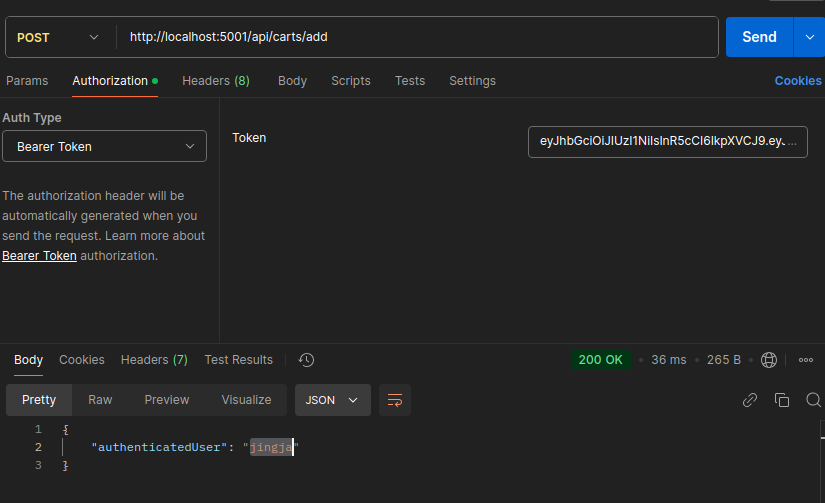

## DAY 1 

## DATE 24 JAN 2025

Install nodemon 
Created nodemon.json

```
    {
        "watch": ["src"],
        "ext": "js,json",
        "ignore": ["node_modules"],
        "exec": "node src/index.js"
    }
```
Run main file index file by `nodemon`

Install `express mongoose dotenv`


## DAY 2

## DATE 25 JAN 2025

Refactor files 
  - docker-composer 
  - index

First, to reflect changes made in the file must get reflected in the container's dir `:/usr/src/app` for that we use 
volume
```
    volumes:
      - .:/usr/src/app
```
however, in dev mode we want auto restart system, for that we have to run nodemon using docker by overriding command

```
    command: npm run dev
```

Also, keep db credentials in the .env file


To run mongo inside from the container

1. docker exec -it mongo bash
2. run mongoose: mongosh -u root -p example --authenticationDatabase admin
3. show databases; use ecommerce;
3. show collections //Cmd: for listing collections
4. db.products.find() // list documents of a particular collection


Also, new routes are added for CRUD operation on product document

Besides, custom functions can also added in the model as shown below 
```}, {
    statics: {
        findByName(name) {
            return this.find({ name: name });
        }
    }
```


## DAY 3

## DATE 26 JAN 2025

Support registering users
Use jsonwebtoken for authentication and information exchange


Use Argon2 hashing algorithm for storing password.

Also, use pre save hooks to save hashed password.

Note: to remove all records in mongodb `db.users.remove({})`


. Added Cart Module, with 1-1 association User and 1-n association with Product

. Added middleware to fetchLoggedIn user details via jwt
. for that first, get the token when user log in then pass as a bearer token via postman 
  
. from req object logged-in user details are retrieved

## DAY 4-5

## DATE 9 FEB 2025

Install React for front-end
commands:
> yarn install vite@latest

Also, install bun over yarn and npm
with this we can locally run dev like
> bun dev

## DAY 6-7-8-9-10

## DATE 22 FEB 2025

Installed CORS for registering domain of front-end

### DAY 11

## DATE 23 FEB 2025

> Dir Str
> /src
> /config # Configuration files (e.g., DB, environment variables)
> /controllers # Request handlers
> /services # Business logic (Service Layer)
> /repositories # Database interactions
> /models # ORM models (Mongoose/Sequelize)
> /routes # Express routes
> /middlewares # Middleware functions
> /utils # Helper functions
> server.js # Entry point


Fetch the specific columns from a document in mongodb
> db.users.find({}, {address: 1, zipcode: 1})


Fetch the specific columns from a document using mongoose
> db.users.find(), select({address: 1, zipcode: 1})


UserEffect Hook:
Used for handling side effects in functional components.

1. Initial Rendering: When the components mounts, useEffects can run its function to perform its operation like data
   fetching
2. Dependencies: Determines when the useEffect should re-run, if any of its value changes, the effect will re-run.
3. Cleanup: This hook returns the clean up function to clean the after effect e.g unsubscribing the events or clearing
   the timers.

Side Effect: An operation that affects something that is outside of the function

Controlled Component: Those components whose data are handled by React component state.
E.g:- StateManagement, EventHandlers, StateUpdates etx

UnControlled Component: Those components whose data is handled by the dom.
E.g:- Direct Dom Manipulation, Event handling, Accessing Form Data

UserEffect Hook:
E.g: Fetching data from external source, updating the component after changing the data 